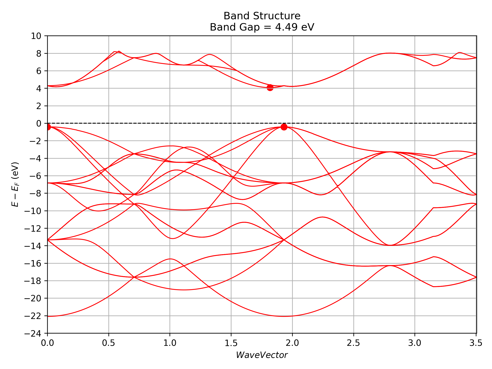

# Contoh Kalkulasi Quantum ESPRESSO untuk Karbon

Berikut ini merupakan contoh kalkulasi Quantum ESPRESSO untuk karbon. Kalkulasi ini akan menghasilkan struktur pita energi dan DOS untuk karbon. Struktur Kristal Karbon dalam contoh ini diperoleh dari [Materials Project](https://next-gen.materialsproject.org/materials/mp-66/).

## Relaksasi Struktur (VC-Relax)

Langkah pertama adalah mengoptimalkan struktur kristal untuk mendapatkan posisi atom dan parameter kisi dalam keadaan keseimbangan. Langkah ini penting untuk memastikan sistem berada dalam konfigurasi energi terendah.
Berikut contoh sederhana *input file* (`carbon_vcr.in`) untuk relaksasi struktur:

    ```plaintext
         &CONTROL
            calculation   = "vc-relax"
            forc_conv_thr =  1.00000e-03
            max_seconds   =  1.72800e+05
            prefix        = "carbon"
            pseudo_dir    = "./pseudo"
            outdir        = "./carbon/vc-relax"
        /

        &SYSTEM
            a           =  3.56075e+00
            degauss     =  1.00000e-02
            ecutrho     =  2.50000e+02
            ecutwfc     =  2.50000e+01
            ibrav       = 1
            nat         = 8
            ntyp        = 1
            occupations = "smearing"
            smearing    = "gaussian"
        /

        &ELECTRONS
            conv_thr         =  1.00000e-12
            electron_maxstep = 200
            mixing_beta      =  7.00000e-01
            startingpot      = "atomic"
            startingwfc      = "atomic+random"
        /

        &IONS
            ion_dynamics = "bfgs"
        /

        &CELL
            cell_dynamics = "bfgs"
            cell_dofree   = "ibrav"
        /

        K_POINTS {automatic}
        8  8  8  0 0 0

        ATOMIC_SPECIES
        C      12.01070  C.pbe-rrkjus.UPF

        ATOMIC_POSITIONS {angstrom}
        C       0.000000   0.000000   1.780373
        C       0.890186   0.890186   2.670559
        C       0.000000   1.780373   0.000000
        C       0.890186   2.670559   0.890186
        C       1.780373   0.000000   0.000000
        C       2.670559   0.890186   0.890186
        C       1.780373   1.780373   1.780373
        C       2.670559   2.670559   2.670559    
    ```

Kalkulasi ini dapat dijalankan dengan perintah berikut:

    ```bash
    pw.x < carbon_vcr.in > carbon_vcr.out
    ```

Setelah kalkulasi selesai, kita dapat melihat hasilnya dengan perintah berikut:

    ```bash
    cat carbon_vcr.out
    ```
Kemudian cari informasi berikut ini

    ```plaintext
         Final enthalpy           =     -91.0731394025 Ry
        Begin final coordinates
        new unit-cell volume =    304.23675 a.u.^3 (    45.08324 Ang^3 )
        density =      3.53910 g/cm^3

        CELL_PARAMETERS (alat=  6.72884230)
        0.999532400   0.000000000   0.000000000
        0.000000000   0.999532400   0.000000000
        0.000000000   0.000000000   0.999532400

        ATOMIC_POSITIONS (angstrom)
        C             0.0000000000        0.0000000000        1.7795404980
        C             0.8897692060        0.8897692060        2.6693107905
        C             0.0000000000        1.7795404980        0.0000000000
        C             0.8897692060        2.6693107905        0.8897692060
        C             1.7795404980        0.0000000000        0.0000000000
        C             2.6693107905        0.8897692060        0.8897692060
        C             1.7795404980        1.7795404980        1.7795404980
        C             2.6693107905        2.6693107905        2.6693107905
        End final coordinates

    ```

Informasi tersebut merupakan struktur cell dan posisi atom yang sudah direlaksasi. Kita dapat menggunakan informasi tersebut untuk kalkulasi selanjutnya.

## Self-Consistent Field (SCF)

Dengan menggunakan menggunakan informasi dari kalkulasi sebelumnya, maka input file untuk kalkulasi SCF kali ini sebagai berikut:

    ```plaintext
        !SCF
        &CONTROL  
        outdir= "./outdir/carbon_1"
        prefix= "carbon"
        calculation= 'scf'
        pseudo_dir= "./pseudo"
        /
        &SYSTEM  
        ibrav=0
        A=3.56075
        nat=8
        ntyp=1
        ecutwfc=30.0
        ecutrho=300.0
        occupations='smearing'
        degauss=0.02
        smearing='gaussian'
        /
        &ELECTRONS  
        /
        ATOMIC_SPECIES  
        C  12.011  C.pbe-n-kjpaw_psl.1.0.0.UPF

        ATOMIC_POSITIONS (angstrom) 
        C  0.0  0.0  1.779540498  1  1  1
        C  0.889769206  0.889769206  2.6693107905  1  1  1
        C  0.0  1.779540498  0.0  1  1  1
        C  0.889769206  2.6693107905  0.889769206  1  1  1
        C  1.779540498  0.0  0.0  1  1  1
        C  2.6693107905  0.889769206  0.889769206  1  1  1
        C  1.779540498  1.779540498  1.779540498  1  1  1
        C  2.6693107905  2.6693107905  2.6693107905  1  1  1

        K_POINTS (automatic) 
        8 8 8 0 0 0
        CELL_PARAMETERS (alat) 
        0.9995324 0.0 0.0
        0.0 0.9995324 0.0
        0.0 0.0 0.9995324

    ```

Input file SCF ini menggunakan struktur cell dan posisi atom yang sudah direlaksasi. Kalkulasi ini dapat dijalankan dengan perintah berikut:

    ```bash
    pw.x < carbon_scf.in > carbon_scf.out
    ```

Dan hasilnya dapat dilihat dengan perintah berikut:

    ```bash
    cat carbon_scf.out
    ```

## Kalkulasi Bands

Berikut ini merupakan contoh input file untuk kalkulasi bands. Untuk memperoleh k path, kalian dapat menggunakan [SeeK-path](https://www.materialscloud.org/work/tools/seekpath/)

    ```plaintext
        !BANDS
        &CONTROL  
        outdir= "/home/mibrohim/qe-module/carbon/outdir/carbon_1"
        prefix= "carbon"
        pseudo_dir= "/home/mibrohim/qe-module/pseudo"
        calculation='bands'
        /
        &SYSTEM  
        ibrav=0
        A=3.56075
        nat=8
        ntyp=1
        ecutwfc=30.0
        ecutrho=300.0
        occupations='smearing'
        degauss=0.02
        smearing='gaussian'
        /
        &ELECTRONS  
        /
        ATOMIC_SPECIES  
        C  12.011  C.pbe-n-kjpaw_psl.1.0.0.UPF

        ATOMIC_POSITIONS (angstrom) 
        C  0.0  0.0  1.779540498  1  1  1
        C  0.889769206  0.889769206  2.6693107905  1  1  1
        C  0.0  1.779540498  0.0  1  1  1
        C  0.889769206  2.6693107905  0.889769206  1  1  1
        C  1.779540498  0.0  0.0  1  1  1
        C  2.6693107905  0.889769206  0.889769206  1  1  1
        C  1.779540498  1.779540498  1.779540498  1  1  1
        C  2.6693107905  2.6693107905  2.6693107905  1  1  1

        K_POINTS (tpiba_b) 
        309
        0.0  0.0  0.0  1  !
        0.0072463768  0.0  0.0072463768  1  !
        0.0144927536  0.0  0.0144927536  1  !
        0.0217391304  0.0  0.0217391304  1  !
        0.0289855072  0.0  0.0289855072  1  !
        0.0362318841  0.0  0.0362318841  1  !
        0.0434782609  0.0  0.0434782609  1  !
        0.0507246377  0.0  0.0507246377  1  !
        0.0579710145  0.0  0.0579710145  1  !
        0.0652173913  0.0  0.0652173913  1  !
        0.0724637681  0.0  0.0724637681  1  !
        0.0797101449  0.0  0.0797101449  1  !
        0.0869565217  0.0  0.0869565217  1  !
        0.0942028986  0.0  0.0942028986  1  !
        0.1014492754  0.0  0.1014492754  1  !
        0.1086956522  0.0  0.1086956522  1  !
        0.115942029  0.0  0.115942029  1  !
        0.1231884058  0.0  0.1231884058  1  !
        0.1304347826  0.0  0.1304347826  1  !
        0.1376811594  0.0  0.1376811594  1  !
        0.1449275362  0.0  0.1449275362  1  !
        0.152173913  0.0  0.152173913  1  !
        0.1594202899  0.0  0.1594202899  1  !
        0.1666666667  0.0  0.1666666667  1  !
        0.1739130435  0.0  0.1739130435  1  !
        0.1811594203  0.0  0.1811594203  1  !
        0.1884057971  0.0  0.1884057971  1  !
        0.1956521739  0.0  0.1956521739  1  !
        0.2028985507  0.0  0.2028985507  1  !
        0.2101449275  0.0  0.2101449275  1  !
        0.2173913043  0.0  0.2173913043  1  !
        0.2246376812  0.0  0.2246376812  1  !
        0.231884058  0.0  0.231884058  1  !
        0.2391304348  0.0  0.2391304348  1  !
        0.2463768116  0.0  0.2463768116  1  !
        0.2536231884  0.0  0.2536231884  1  !
        0.2608695652  0.0  0.2608695652  1  !
        0.268115942  0.0  0.268115942  1  !
        0.2753623188  0.0  0.2753623188  1  !
        0.2826086957  0.0  0.2826086957  1  !
        0.2898550725  0.0  0.2898550725  1  !
        0.2971014493  0.0  0.2971014493  1  !
        0.3043478261  0.0  0.3043478261  1  !
        0.3115942029  0.0  0.3115942029  1  !
        0.3188405797  0.0  0.3188405797  1  !
        0.3260869565  0.0  0.3260869565  1  !
        0.3333333333  0.0  0.3333333333  1  !
        0.3405797101  0.0  0.3405797101  1  !
        0.347826087  0.0  0.347826087  1  !
        0.3550724638  0.0  0.3550724638  1  !
        0.3623188406  0.0  0.3623188406  1  !
        0.3695652174  0.0  0.3695652174  1  !
        0.3768115942  0.0  0.3768115942  1  !
        0.384057971  0.0  0.384057971  1  !
        0.3913043478  0.0  0.3913043478  1  !
        0.3985507246  0.0  0.3985507246  1  !
        0.4057971014  0.0  0.4057971014  1  !
        0.4130434783  0.0  0.4130434783  1  !
        0.4202898551  0.0  0.4202898551  1  !
        0.4275362319  0.0  0.4275362319  1  !
        0.4347826087  0.0  0.4347826087  1  !
        0.4420289855  0.0  0.4420289855  1  !
        0.4492753623  0.0  0.4492753623  1  !
        0.4565217391  0.0  0.4565217391  1  !
        0.4637681159  0.0  0.4637681159  1  !
        0.4710144928  0.0  0.4710144928  1  !
        0.4782608696  0.0  0.4782608696  1  !
        0.4855072464  0.0  0.4855072464  1  !
        0.4927536232  0.0  0.4927536232  1  !
        0.5  0.0  0.5  1  !
        0.5054347826  0.0108695652  0.5054347826  1  !
        0.5108695652  0.0217391304  0.5108695652  1  !
        0.5163043478  0.0326086957  0.5163043478  1  !
        0.5217391304  0.0434782609  0.5217391304  1  !
        0.527173913  0.0543478261  0.527173913  1  !
        0.5326086957  0.0652173913  0.5326086957  1  !
        0.5380434783  0.0760869565  0.5380434783  1  !
        0.5434782609  0.0869565217  0.5434782609  1  !
        0.5489130435  0.097826087  0.5489130435  1  !
        0.5543478261  0.1086956522  0.5543478261  1  !
        0.5597826087  0.1195652174  0.5597826087  1  !
        0.5652173913  0.1304347826  0.5652173913  1  !
        0.5706521739  0.1413043478  0.5706521739  1  !
        0.5760869565  0.152173913  0.5760869565  1  !
        0.5815217391  0.1630434783  0.5815217391  1  !
        0.5869565217  0.1739130435  0.5869565217  1  !
        0.5923913043  0.1847826087  0.5923913043  1  !
        0.597826087  0.1956521739  0.597826087  1  !
        0.6032608696  0.2065217391  0.6032608696  1  !
        0.6086956522  0.2173913043  0.6086956522  1  !
        0.6141304348  0.2282608696  0.6141304348  1  !
        0.6195652174  0.2391304348  0.6195652174  1  !
        0.625  0.25  0.625  1  !
        0.375  0.375  0.75  1  !
        0.3698630137  0.3698630137  0.7397260274  1  !
        0.3647260274  0.3647260274  0.7294520548  1  !
        0.3595890411  0.3595890411  0.7191780822  1  !
        0.3544520548  0.3544520548  0.7089041096  1  !
        0.3493150685  0.3493150685  0.698630137  1  !
        0.3441780822  0.3441780822  0.6883561644  1  !
        0.3390410959  0.3390410959  0.6780821918  1  !
        0.3339041096  0.3339041096  0.6678082192  1  !
        0.3287671233  0.3287671233  0.6575342466  1  !
        0.323630137  0.323630137  0.647260274  1  !
        0.3184931507  0.3184931507  0.6369863014  1  !
        0.3133561644  0.3133561644  0.6267123288  1  !
        0.3082191781  0.3082191781  0.6164383562  1  !
        0.3030821918  0.3030821918  0.6061643836  1  !
        0.2979452055  0.2979452055  0.595890411  1  !
        0.2928082192  0.2928082192  0.5856164384  1  !
        0.2876712329  0.2876712329  0.5753424658  1  !
        0.2825342466  0.2825342466  0.5650684932  1  !
        0.2773972603  0.2773972603  0.5547945205  1  !
        0.272260274  0.272260274  0.5445205479  1  !
        0.2671232877  0.2671232877  0.5342465753  1  !
        0.2619863014  0.2619863014  0.5239726027  1  !
        0.2568493151  0.2568493151  0.5136986301  1  !
        0.2517123288  0.2517123288  0.5034246575  1  !
        0.2465753425  0.2465753425  0.4931506849  1  !
        0.2414383562  0.2414383562  0.4828767123  1  !
        0.2363013699  0.2363013699  0.4726027397  1  !
        0.2311643836  0.2311643836  0.4623287671  1  !
        0.2260273973  0.2260273973  0.4520547945  1  !
        0.220890411  0.220890411  0.4417808219  1  !
        0.2157534247  0.2157534247  0.4315068493  1  !
        0.2106164384  0.2106164384  0.4212328767  1  !
        0.2054794521  0.2054794521  0.4109589041  1  !
        0.2003424658  0.2003424658  0.4006849315  1  !
        0.1952054795  0.1952054795  0.3904109589  1  !
        0.1900684932  0.1900684932  0.3801369863  1  !
        0.1849315068  0.1849315068  0.3698630137  1  !
        0.1797945205  0.1797945205  0.3595890411  1  !
        0.1746575342  0.1746575342  0.3493150685  1  !
        0.1695205479  0.1695205479  0.3390410959  1  !
        0.1643835616  0.1643835616  0.3287671233  1  !
        0.1592465753  0.1592465753  0.3184931507  1  !
        0.154109589  0.154109589  0.3082191781  1  !
        0.1489726027  0.1489726027  0.2979452055  1  !
        0.1438356164  0.1438356164  0.2876712329  1  !
        0.1386986301  0.1386986301  0.2773972603  1  !
        0.1335616438  0.1335616438  0.2671232877  1  !
        0.1284246575  0.1284246575  0.2568493151  1  !
        0.1232876712  0.1232876712  0.2465753425  1  !
        0.1181506849  0.1181506849  0.2363013699  1  !
        0.1130136986  0.1130136986  0.2260273973  1  !
        0.1078767123  0.1078767123  0.2157534247  1  !
        0.102739726  0.102739726  0.2054794521  1  !
        0.0976027397  0.0976027397  0.1952054795  1  !
        0.0924657534  0.0924657534  0.1849315068  1  !
        0.0873287671  0.0873287671  0.1746575342  1  !
        0.0821917808  0.0821917808  0.1643835616  1  !
        0.0770547945  0.0770547945  0.154109589  1  !
        0.0719178082  0.0719178082  0.1438356164  1  !
        0.0667808219  0.0667808219  0.1335616438  1  !
        0.0616438356  0.0616438356  0.1232876712  1  !
        0.0565068493  0.0565068493  0.1130136986  1  !
        0.051369863  0.051369863  0.102739726  1  !
        0.0462328767  0.0462328767  0.0924657534  1  !
        0.0410958904  0.0410958904  0.0821917808  1  !
        0.0359589041  0.0359589041  0.0719178082  1  !
        0.0308219178  0.0308219178  0.0616438356  1  !
        0.0256849315  0.0256849315  0.051369863  1  !
        0.0205479452  0.0205479452  0.0410958904  1  !
        0.0154109589  0.0154109589  0.0308219178  1  !
        0.0102739726  0.0102739726  0.0205479452  1  !
        0.0051369863  0.0051369863  0.0102739726  1  !
        0.0  0.0  0.0  1  !
        0.0083333333  0.0083333333  0.0083333333  1  !
        0.0166666667  0.0166666667  0.0166666667  1  !
        0.025  0.025  0.025  1  !
        0.0333333333  0.0333333333  0.0333333333  1  !
        0.0416666667  0.0416666667  0.0416666667  1  !
        0.05  0.05  0.05  1  !
        0.0583333333  0.0583333333  0.0583333333  1  !
        0.0666666667  0.0666666667  0.0666666667  1  !
        0.075  0.075  0.075  1  !
        0.0833333333  0.0833333333  0.0833333333  1  !
        0.0916666667  0.0916666667  0.0916666667  1  !
        0.1  0.1  0.1  1  !
        0.1083333333  0.1083333333  0.1083333333  1  !
        0.1166666667  0.1166666667  0.1166666667  1  !
        0.125  0.125  0.125  1  !
        0.1333333333  0.1333333333  0.1333333333  1  !
        0.1416666667  0.1416666667  0.1416666667  1  !
        0.15  0.15  0.15  1  !
        0.1583333333  0.1583333333  0.1583333333  1  !
        0.1666666667  0.1666666667  0.1666666667  1  !
        0.175  0.175  0.175  1  !
        0.1833333333  0.1833333333  0.1833333333  1  !
        0.1916666667  0.1916666667  0.1916666667  1  !
        0.2  0.2  0.2  1  !
        0.2083333333  0.2083333333  0.2083333333  1  !
        0.2166666667  0.2166666667  0.2166666667  1  !
        0.225  0.225  0.225  1  !
        0.2333333333  0.2333333333  0.2333333333  1  !
        0.2416666667  0.2416666667  0.2416666667  1  !
        0.25  0.25  0.25  1  !
        0.2583333333  0.2583333333  0.2583333333  1  !
        0.2666666667  0.2666666667  0.2666666667  1  !
        0.275  0.275  0.275  1  !
        0.2833333333  0.2833333333  0.2833333333  1  !
        0.2916666667  0.2916666667  0.2916666667  1  !
        0.3  0.3  0.3  1  !
        0.3083333333  0.3083333333  0.3083333333  1  !
        0.3166666667  0.3166666667  0.3166666667  1  !
        0.325  0.325  0.325  1  !
        0.3333333333  0.3333333333  0.3333333333  1  !
        0.3416666667  0.3416666667  0.3416666667  1  !
        0.35  0.35  0.35  1  !
        0.3583333333  0.3583333333  0.3583333333  1  !
        0.3666666667  0.3666666667  0.3666666667  1  !
        0.375  0.375  0.375  1  !
        0.3833333333  0.3833333333  0.3833333333  1  !
        0.3916666667  0.3916666667  0.3916666667  1  !
        0.4  0.4  0.4  1  !
        0.4083333333  0.4083333333  0.4083333333  1  !
        0.4166666667  0.4166666667  0.4166666667  1  !
        0.425  0.425  0.425  1  !
        0.4333333333  0.4333333333  0.4333333333  1  !
        0.4416666667  0.4416666667  0.4416666667  1  !
        0.45  0.45  0.45  1  !
        0.4583333333  0.4583333333  0.4583333333  1  !
        0.4666666667  0.4666666667  0.4666666667  1  !
        0.475  0.475  0.475  1  !
        0.4833333333  0.4833333333  0.4833333333  1  !
        0.4916666667  0.4916666667  0.4916666667  1  !
        0.5  0.5  0.5  1  !
        0.5  0.4947916667  0.5052083333  1  !
        0.5  0.4895833333  0.5104166667  1  !
        0.5  0.484375  0.515625  1  !
        0.5  0.4791666667  0.5208333333  1  !
        0.5  0.4739583333  0.5260416667  1  !
        0.5  0.46875  0.53125  1  !
        0.5  0.4635416667  0.5364583333  1  !
        0.5  0.4583333333  0.5416666667  1  !
        0.5  0.453125  0.546875  1  !
        0.5  0.4479166667  0.5520833333  1  !
        0.5  0.4427083333  0.5572916667  1  !
        0.5  0.4375  0.5625  1  !
        0.5  0.4322916667  0.5677083333  1  !
        0.5  0.4270833333  0.5729166667  1  !
        0.5  0.421875  0.578125  1  !
        0.5  0.4166666667  0.5833333333  1  !
        0.5  0.4114583333  0.5885416667  1  !
        0.5  0.40625  0.59375  1  !
        0.5  0.4010416667  0.5989583333  1  !
        0.5  0.3958333333  0.6041666667  1  !
        0.5  0.390625  0.609375  1  !
        0.5  0.3854166667  0.6145833333  1  !
        0.5  0.3802083333  0.6197916667  1  !
        0.5  0.375  0.625  1  !
        0.5  0.3697916667  0.6302083333  1  !
        0.5  0.3645833333  0.6354166667  1  !
        0.5  0.359375  0.640625  1  !
        0.5  0.3541666667  0.6458333333  1  !
        0.5  0.3489583333  0.6510416667  1  !
        0.5  0.34375  0.65625  1  !
        0.5  0.3385416667  0.6614583333  1  !
        0.5  0.3333333333  0.6666666667  1  !
        0.5  0.328125  0.671875  1  !
        0.5  0.3229166667  0.6770833333  1  !
        0.5  0.3177083333  0.6822916667  1  !
        0.5  0.3125  0.6875  1  !
        0.5  0.3072916667  0.6927083333  1  !
        0.5  0.3020833333  0.6979166667  1  !
        0.5  0.296875  0.703125  1  !
        0.5  0.2916666667  0.7083333333  1  !
        0.5  0.2864583333  0.7135416667  1  !
        0.5  0.28125  0.71875  1  !
        0.5  0.2760416667  0.7239583333  1  !
        0.5  0.2708333333  0.7291666667  1  !
        0.5  0.265625  0.734375  1  !
        0.5  0.2604166667  0.7395833333  1  !
        0.5  0.2552083333  0.7447916667  1  !
        0.5  0.25  0.75  1  !
        0.5  0.2426470588  0.7426470588  1  !
        0.5  0.2352941176  0.7352941176  1  !
        0.5  0.2279411765  0.7279411765  1  !
        0.5  0.2205882353  0.7205882353  1  !
        0.5  0.2132352941  0.7132352941  1  !
        0.5  0.2058823529  0.7058823529  1  !
        0.5  0.1985294118  0.6985294118  1  !
        0.5  0.1911764706  0.6911764706  1  !
        0.5  0.1838235294  0.6838235294  1  !
        0.5  0.1764705882  0.6764705882  1  !
        0.5  0.1691176471  0.6691176471  1  !
        0.5  0.1617647059  0.6617647059  1  !
        0.5  0.1544117647  0.6544117647  1  !
        0.5  0.1470588235  0.6470588235  1  !
        0.5  0.1397058824  0.6397058824  1  !
        0.5  0.1323529412  0.6323529412  1  !
        0.5  0.125  0.625  1  !
        0.5  0.1176470588  0.6176470588  1  !
        0.5  0.1102941176  0.6102941176  1  !
        0.5  0.1029411765  0.6029411765  1  !
        0.5  0.0955882353  0.5955882353  1  !
        0.5  0.0882352941  0.5882352941  1  !
        0.5  0.0808823529  0.5808823529  1  !
        0.5  0.0735294118  0.5735294118  1  !
        0.5  0.0661764706  0.5661764706  1  !
        0.5  0.0588235294  0.5588235294  1  !
        0.5  0.0514705882  0.5514705882  1  !
        0.5  0.0441176471  0.5441176471  1  !
        0.5  0.0367647059  0.5367647059  1  !
        0.5  0.0294117647  0.5294117647  1  !
        0.5  0.0220588235  0.5220588235  1  !
        0.5  0.0147058824  0.5147058824  1  !
        0.5  0.0073529412  0.5073529412  1  !
        0.5  0.0  0.5  1  !

        CELL_PARAMETERS (alat) 
        0.9995324 0.0 0.0
        0.0 0.9995324 0.0
        0.0 0.0 0.9995324
    ```
Kalkulasi ini dapat dijalankan dengan perintah berikut:

    ```bash
    pw.x < carbon_bands.in > carbon_bands.out
    ```

## Post-processing Kalkulasi Bands

Tahap ini dilakukan agar file output yang dihasilkan dapat dibaca oleh program visualisasi band structure.
Berikut ini merupakan contoh input file untuk post-processing kalkulasi bands:

    ```plaintext
        !BANDSPP
        &BANDS  
        outdir= "./outdir/carbon_1"
        filband='bands.out'
    /
    ```
Kalkulasi ini dapat dijalankan dengan perintah berikut:

    ```bash
    bands.x < carbon_bandspp.in > carbon_bandspp.out
    ```

## Visualisasi Band Structure

Kalian dapat plot file bands.out.gnu dengan Web App [EspressoIn | Tools](https://espresoin-tools.streamlit.app/).

Berikut ini merupakan contoh plot band structure dari kalkulasi bands:

